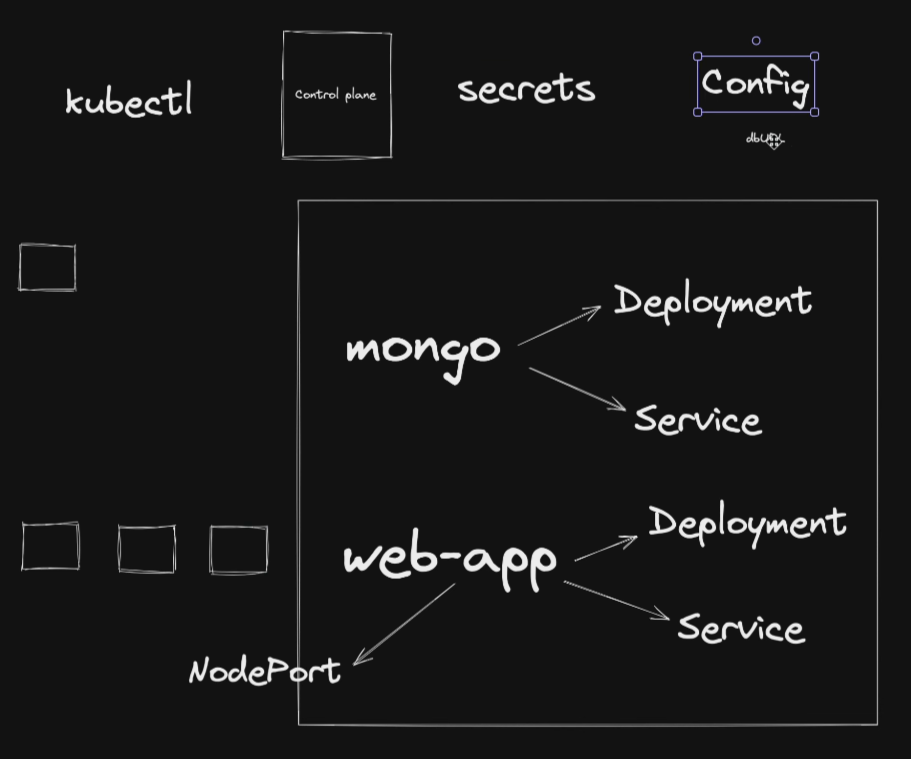

# Readme

## Commands

---

minikube start

minikube ip

<!-- open ports & run the app -->

minikube service webapp-service

minikube stop

---

kubectl get nodes

kubectl get pods -o wide

kubectl get secret

kubectl get configMap

kubectl get svc

---

kubectl apply -f secret.yaml

kubectl apply -f mongo-config.yaml

kubectl apply -f mongo-app.yaml

kubectl apply -f web-app.yaml

---

kubectl delete deployment --all

kubectl delete service --all

kubectl delete secret --all

kubectl delete configmap --all

kubectl delete pod name
